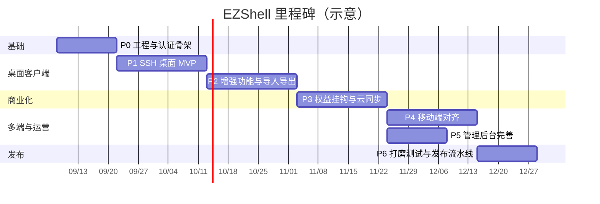

# EZShell 开发计划

| 项 | 内容 |
|---|---|
| 产品名称 | EZShell |
| 文档版本 | v1.0 |
| 更新日期 | 2026-09-08 |
| 依据文档 | [EZShell需求说明书.md](./EZShell需求说明书.md) v1.0 |
| 文档类型 | 研发实施计划（里程碑 + 任务拆解） |

---

## 1. 计划总览

### 1.1 目标

在约 **16～20 周**内，交付可商业化运营的跨端 SSH 运维工具 + SaaS 会员平台：

1. **桌面端（Electron）**：完整 SSH / SFTP / 片段 / 转发 / 导入导出（含 MobaXterm）
2. **移动端（uni-app）**：对齐桌面核心能力
3. **SaaS API + 管理后台**：账号、套餐、权益、云同步、运营管理
4. **工程基线**：pnpm monorepo、中文规范、可本地一键启动

### 1.2 首期决策锁定（来自 PRD §13 建议默认）

| 编号 | 决策 | 结论 | 影响 |
|---|---|---|---|
| D1 | 支付 | **后台手动开通** + 支付接口抽象预留 | P3/P5 不阻塞真实支付对接 |
| D2 | 云同步加密 | **端到端加密** | packages/core 需做密钥派生与密文同步 |
| D3 | 注册方式 | **先邮箱** | API 认证首期不做短信 |
| D4 | Team 席位 | **数据模型 + 后台骨架**，客户端延后 | P3 不做完整团队协作 UI |
| D5 | Flutter 原型 | **新开 ezshell monorepo**，原型仅作交互参考 | 当前仓库从零搭建 |

> 若后续变更上述决策，需同步修订本计划里程碑范围。

### 1.3 里程碑一览



| 阶段 | 周期（建议） | 核心产出 | 发布门禁 |
|---|---|---|---|
| **P0** | 第 1～2 周 | monorepo + shared/sdk + API 认证/套餐骨架 + admin 空壳 | 可注册登录的空壳平台 |
| **P1** | 第 3～5 周 | Electron：主机/密钥/终端/密码弹窗 | 可真实 SSH 的桌面 MVP |
| **P2** | 第 6～8 周 | SFTP、片段、转发、OpenSSH/Moba/备份导入导出 | 增强版桌面客户端 |
| **P3** | 第 9～11 周 | 会员权益挂钩 + 端到端云同步 | 商业化闭环雏形 |
| **P4** | 第 12～14 周 | uni-app 对齐桌面核心能力 | 双端可用 |
| **P5** | 与 P4 并行约 2 周 | web-admin 完善 + 手动开通运营闭环 | 可运营 |
| **P6** | 第 15～16+ 周 | 测试、文档、CI/CD、发布 | 可发布 |

**并行策略**：P5 可在 P3 结束后与 P4 并行；P2 后期可提前启动 API 同步协议设计。

---

## 2. 技术基线（开工前冻结）

### 2.1 技术选型

| 层 | 选型 | 说明 |
|---|---|---|
| 包管理 | **仅 pnpm** | 禁止 npm/yarn |
| 仓库 | pnpm monorepo | `apps/*` + `packages/*` |
| 桌面 | Electron + Vue3 + TypeScript | Vite 构建 |
| 移动 | uni-app + Vue3 + TypeScript | Android / iOS |
| 管理后台 | Vue3 + TypeScript + Vite | 与 portal 可共用 UI 基础 |
| API | NestJS（推荐）+ TypeScript | 模块清晰，利于权益中间件 |
| DB | PostgreSQL | 主数据 |
| 缓存 | Redis | 会话、限流、权益短期缓存 |
| ORM | Prisma 或 TypeORM（开工时二选一） | 建议 Prisma |
| SSH | node-ssh / ssh2（桌面主进程） | 私钥与密码走安全存储 |
| 终端 UI | xterm.js（桌面） | 移动端用适配方案 |
| 本地安全存储 | keytar / electron-store 加密区 | 密码、私钥、口令 |
| 本地元数据 | SQLite（better-sqlite3）或 JSON+迁移层 | 主机/分组/片段等 |

### 2.2 目标目录结构

```text
ezshell/
  package.json
  pnpm-workspace.yaml
  apps/
    desktop/                 # Electron
    mobile/                  # uni-app
    api/                     # SaaS API
    web-admin/               # 运营后台
    web-portal/              # 官网（二期可选，P0 可占位）
  packages/
    shared/                  # 类型、枚举、错误码、备份格式、校验
    core/                    # 主机/密钥/片段/导入导出纯逻辑
    ui-tokens/               # 设计 token
    sdk/                     # API TypeScript SDK
  docs/
  README.md
```

### 2.3 根脚本约定（P0 验收）

| 脚本 | 用途 |
|---|---|
| `pnpm install` | 安装全部 workspace |
| `pnpm dev:api` | 启动 API |
| `pnpm dev:desktop` | 启动桌面端 |
| `pnpm dev:mobile` | 启动移动端 H5/模拟器 |
| `pnpm dev:admin` | 启动管理后台 |
| `pnpm build` | 全量构建（可分步） |
| `pnpm lint` / `pnpm test` | 质量门禁 |

### 2.4 工程规范

- 界面文案、代码注释、提交说明：**中文**
- Conventional Commits：`feat` / `fix` / `docs` / `refactor` / `test` / `chore`
- 命名：变量/函数 camelCase；常量 UPPER_SNAKE_CASE
- 敏感信息仅环境变量；禁止硬编码密钥
- `packages/shared`、`packages/core` **不得**依赖 Electron / uni-app 运行时

---

## 3. 阶段详细计划

### P0 — 工程骨架与认证平台（第 1～2 周）

**目标**：可登录的空壳平台，后续功能有落点。

#### 任务拆解

| ID | 任务 | 负责人建议 | 产出 |
|---|---|---|---|
| P0-1 | 初始化 pnpm workspace、TS 基线、ESLint/Prettier、`.env.example` | 全栈 | 可 `pnpm install` |
| P0-2 | 搭建 `packages/shared`：用户/套餐/主机等领域类型、错误码、校验 schema | 后端偏 | 类型包可被引用 |
| P0-3 | 搭建 `packages/sdk`：HTTP 客户端骨架（鉴权头、刷新令牌钩子） | 后端 | SDK 可调健康检查 |
| P0-4 | 搭建 `apps/api`：NestJS、PostgreSQL、Redis、迁移 | 后端 | 健康检查接口 |
| P0-5 | 认证模块：邮箱注册/登录、Access+Refresh、登出作废 | 后端 | 认证可用 |
| P0-6 | 套餐/订阅骨架：Free/Pro/Team 配置表 + 当前权益查询 | 后端 | `/me/entitlements` |
| P0-7 | `apps/web-admin` 空壳：登录页 + 布局 + 路由占位 | 前端 | 管理员可登录（可先共用用户或独立 Admin） |
| P0-8 | `apps/desktop` Electron + Vue 空壳：侧栏导航骨架、关于页 | 桌面 | 窗口可启动 |
| P0-9 | `apps/mobile` uni-app 空壳：底栏占位 | 移动 | 可运行到模拟器/H5 |
| P0-10 | README：启动步骤、环境变量、目录说明 | 文档 | 新人可跟文档跑通 |

#### 验收标准

- [ ] `pnpm install` 成功；四个 `dev:*` 脚本可启动
- [ ] 邮箱注册 → 登录 → 刷新令牌 → 登出全流程通过
- [ ] 新用户默认为 Free 权益
- [ ] 无密钥硬编码；`.env.example` 齐全

#### 风险

- Electron + pnpm monorepo 依赖提升配置易踩坑 → 首周集中验证打包链路

---

### P1 — 桌面 SSH MVP（第 3～5 周）

**目标**：可真实 SSH 连接的桌面 MVP（PRD 用户故事 2、3）。

#### 任务拆解

| ID | 任务 | 产出 |
|---|---|---|
| P1-1 | `packages/core`：主机/分组 CRUD 模型与校验（端口 1–65535） | 纯逻辑可单测 |
| P1-2 | 桌面本地存储：元数据 DB + 安全存储（密码/私钥） | 持久化可用 |
| P1-3 | 主机与分组 UI：列表、搜索、筛选、CRUD 表单、空状态引导 | 主机管理可用 |
| P1-4 | 密钥管理：生成 Ed25519、导入 OpenSSH（Ed25519/RSA）、指纹、绑定主机 | 公钥认证可用 |
| P1-5 | SSH 会话主进程：连接/断开/重连、超时（默认 15s）、中文错误映射 | 连接引擎 |
| P1-6 | xterm 多标签终端：渲染、复制粘贴、字体/配色预设、状态可视化 | 终端可用 |
| P1-7 | **密码输入关键路径**（必须）：弹窗、记住密码、失败提示条、「输入密码并重连」、取消不崩溃 | 无 AuthAbort 死路 |
| P1-8 | 首次连接主机指纹确认与本地记忆 | 安全基线 |
| P1-9 | 快捷键：`Ctrl+T` / `Ctrl+W`；侧栏信息架构按 PRD §5.1 | 交互达标 |

#### 验收标准

- [ ] 建主机 → 密码连接 → 终端交互
- [ ] 建主机 → 密钥连接 → 终端交互
- [ ] 未存密码可弹窗输入；勾选记住后下次自动用
- [ ] 认证失败可在会话页再次输入密码重试
- [ ] 非法端口/空必填有中文提示

#### 依赖

- 依赖 P0 的 desktop 壳；本阶段可不强制登录（账户入口可占位）

---

### P2 — 桌面增强与导入导出（第 6～8 周）

**目标**：SFTP、片段、端口转发、配置迁移（PRD 用户故事 1、7）。

#### 任务拆解

| ID | 任务 | 产出 |
|---|---|---|
| P2-1 | SFTP：浏览/上级/刷新/上传/下载/重命名/删除；与会话关联 | SFTP 可用 |
| P2-2 | 命令片段：CRUD、分类、`{host}`/`{user}`/`{name}`/`{port}`、发送到活动终端 | 片段可用 |
| P2-3 | 端口转发：Local/Remote、启停、资源释放、失败中文提示 | 转发可用 |
| P2-4 | EZShell 备份：明文 JSON / 加密 `.ezb`（AES+口令）、合并/覆盖导入 | 备份可用 |
| P2-5 | OpenSSH `config` 导入（忽略通配 Host） | OpenSSH 迁移 |
| P2-6 | **MobaXterm 导入（必须）**：`.mobaconf` / `.mxtsessions`；仅 `#109#`；分组；去重；指纹尽力导入；密码不可还原备注；编码回退 | Moba 迁移 |
| P2-7 | 设置页集中导入导出入口；关于页版本信息 | 设置完善 |
| P2-8 | `packages/core` 单测：导入解析、备份加解密、片段变量替换 | 质量保障 |

#### 验收标准

- [ ] 已连接会话可完成 SFTP 上传下载；未连接有明确提示
- [ ] 无活动会话发片段时提示「当前没有活动终端会话」
- [ ] 本地转发本机可访问远端目标（测试环境）
- [ ] 真实 Moba 导出文件可导入多台 SSH 主机
- [ ] 加密备份正确口令可恢复；错误口令有明确失败提示
- [ ] 导入失败不破坏已有数据

#### 风险

- Moba 格式多样、编码混乱 → 预留样例文件目录 `docs/fixtures/moba/`，用真实导出做回归

---

### P3 — 会员权益与云同步（第 9～11 周）

**目标**：商业化闭环雏形（PRD 用户故事 4、5、6）。

#### 任务拆解

| ID | 任务 | 产出 |
|---|---|---|
| P3-1 | API 权益中间件：按 Plan 校验主机上限、同步开关、设备数 | 服务端权威 |
| P3-2 | 桌面账户页：登录态、套餐展示、到期时间、同步开关 | 客户端展示 |
| P3-3 | Free 主机数限制（如 ≤5）：本地创建时校验 + 云端二次校验 | 降级策略 |
| P3-4 | 订阅状态机：未开通/有效/宽限期/已过期 → 回 Free；本地数据不删 | 到期行为 |
| P3-5 | 设备会话：登录登记、列表、踢下线（Pro+ 可优先） | 多设备管理 |
| P3-6 | 订单骨架：SKU、价格、周期；状态机；**手动开通接口**（D1） | 可后台开通 |
| P3-7 | 云同步协议：推送/拉取变更、对象版本或字段 LMT | 同步 API |
| P3-8 | **端到端加密（D2）**：同步口令派生密钥；服务端只存密文；产品文案告知 | 安全同步 |
| P3-9 | 冲突 UI：保留本地 / 使用云端 | 冲突可解 |
| P3-10 | 默认同步对象：主机元数据、分组、片段、转发；密钥/密码默认不上云 | 符合 PRD |

#### 验收标准

- [ ] Free 超限无法继续添加主机（提示升级）
- [ ] Pro 开通后云同步可用；过期后停止推拉，本地保留
- [ ] 服务端无法读取同步明文（E2E 验证）
- [ ] 管理员可通过 API/后台给用户开通一年 Pro
- [ ] 支付抽象接口存在，真实渠道可后续接入

#### 风险

- E2E 密钥丢失无法恢复 → 产品需明确「忘记同步口令=无法解密云端数据」，并提供仅本地导出兜底

---

### P4 — 移动端对齐（第 12～14 周）

**目标**：双端主流程可用，视觉与文案一致。

#### 任务拆解

| ID | 任务 | 产出 |
|---|---|---|
| P4-1 | 信息架构：底栏主机 / 密钥 / 片段 / 我的 | 导航完成 |
| P4-2 | 主机连接 + 全屏终端 + 认证失败顶部「输入密码」 | SSH 主路径 |
| P4-3 | SFTP、片段发送（大触控目标） | 核心增强 |
| P4-4 | 登录会员、同步开关（复用 sdk + core） | 与桌面一致 |
| P4-5 | 导入导出（至少 EZShell 备份；Moba 按端能力评估） | 迁移能力 |
| P4-6 | ui-tokens 对齐：主色青绿、深色终端、品牌名 EZShell | 视觉统一 |
| P4-7 | Android / iOS 近两版真机冒烟 | 兼容性 |

#### 验收标准

- [ ] 建主机 → 连接 → 终端 → SFTP → 片段 主流程通
- [ ] 密码弹窗/失败重试路径与桌面文案一致
- [ ] Pro 用户手机与电脑同步主机与片段

#### 说明

- 端口转发在移动端可做「查看/受限启停」或二期完整实现，需在本阶段开工时确认范围。

---

### P5 — 管理后台与运营闭环（与 P4 并行，约 2 周）

**目标**：可运营（手动开通路径）。

#### 任务拆解

| ID | 任务 | 产出 |
|---|---|---|
| P5-1 | 用户管理：列表、搜索、详情、封禁/解封、重置密码 | 用户运营 |
| P5-2 | 会员管理：开通、改档、延期、取消、到期时间 | 对应 D1 |
| P5-3 | 订单流水查询与状态筛选 | 财务可视 |
| P5-4 | 套餐配置：价格、周期、权益开关与额度 | 运营可配 |
| P5-5 | 公告 + 客户端拉取 / 强制更新提示 | 运营触达 |
| P5-6 | 基础看板：注册量、付费用户、活跃设备 | 数据概览 |
| P5-7 | 审计日志；超级管理员单角色；RBAC 表结构预留 | 安全与扩展 |
| P5-8 | Team 席位数据模型 + 后台骨架（D4，不做客户端完整协作） | 二期预留 |

#### 验收标准

- [ ] 后台可完成：查用户 → 开通 Pro 一年 → 客户端权益即时刷新
- [ ] 关键操作有审计记录
- [ ] 套餐额度修改后客户端/API 读取同一配置源

---

### P6 — 打磨、测试与发布（第 15～16+ 周）

**目标**：可发布。

#### 任务拆解

| ID | 任务 | 产出 |
|---|---|---|
| P6-1 | 对照 PRD §11 全量验收清单 | 门禁清单勾选 |
| P6-2 | E2E：桌面主路径、导入样例、同步冲突、权益降级 | 自动化/半自动脚本 |
| P6-3 | 安全复查：HTTPS、哈希、日志脱敏、环境变量、管理端鉴权 | 安全基线 |
| P6-4 | CI：lint、单测、api 构建、desktop 构建产物 | GitHub Actions 等 |
| P6-5 | 桌面安装包（Win/macOS/Linux）与移动端打包说明 | 分发物 |
| P6-6 | 文档：用户手册摘要、运维部署、OpenAPI 导出 | 文档齐备 |
| P6-7 | 性能抽检：本地列表 < 300ms；连接超时可配 | 非功能达标 |
| P6-8 | 发布 checklist 与回滚预案 | 上线就绪 |

#### 验收标准

- [ ] PRD §11.1 / 11.2 / 11.3 全部勾选
- [ ] README 含启动与环境变量说明
- [ ] 无密钥硬编码；客户端日志无明文密码/私钥

---

## 4. 模块责任矩阵（RACI 简表）

| 模块 | packages/core | apps/desktop | apps/mobile | apps/api | apps/web-admin |
|---|---|---|---|---|---|
| 主机/密钥/片段模型 | R | C | C | — | — |
| SSH/SFTP/转发运行时 | — | R | R（适配） | — | — |
| Moba/OpenSSH/备份解析 | R | C | C | — | — |
| 认证/套餐/订单 | — | C | C | R | C |
| 云同步协议与密文存储 | C（加解密） | C | C | R（存取） | — |
| 权益校验 | — | 展示 | 展示 | **权威 R** | 配置 |
| 用户/会员运营 | — | — | — | R | R |

R=负责执行，C=协作使用

---

## 5. 关键路径与联调节奏

### 5.1 每周固定节奏（建议）

| 日 | 活动 |
|---|---|
| 周一 | 周目标对齐、阻塞升级 |
| 周三 | 跨端联调（desktop ↔ api / admin ↔ api） |
| 周五 | Demo + 对照本阶段验收勾选 |

### 5.2 优先联调用例（贯穿 P1～P3）

1. 未存密码主机连接 → 记住密码 → 重连自动登录  
2. Moba 导入 → 当场输密码连接  
3. Free 第 6 台主机被拒 → 后台开通 Pro → 立即成功  
4. Pro 开启同步 → 第二台设备拉取一致 → 制造冲突手动解决  
5. 订阅过期 → 本地主机仍在 → 同步停止  

---

## 6. 测试策略

| 层级 | 范围 | 阶段 |
|---|---|---|
| 单元测试 | `packages/core` 解析/加解密/校验；API 权益中间件 | P1 起持续 |
| 集成测试 | API 认证、订单状态机、同步冲突 | P3 |
| 手工/半自动 E2E | SSH 真机、SFTP、转发、Moba 真实文件 | P1～P2 |
| 回归清单 | PRD §11 门禁表 | P6 |
| 安全 | 日志脱敏、E2E 密文、管理审计 | P3、P6 |

**样例资产**：维护 `docs/fixtures/`（脱敏后的 OpenSSH config、Moba 导出、备份 JSON）。

---

## 7. 人力与排期假设

按 **2～3 名全职研发**估算（可 1 桌面偏前端 + 1 后端 + 1 移动/兼后台）：

| 角色 | 主责阶段 |
|---|---|
| 桌面客户端 | P1、P2，支援 P3 账户/同步 UI |
| 后端 / SaaS | P0、P3、P5 |
| 移动端 | P0 壳、P4；空档支援 web-admin |
| 兼设计 | P0 定 token；P1/P4 走查 |

人员减少时建议保序：**P0 → P1 → P2 → P3 → P5 → P4 → P6**（先桌面商业化，后移动）。

---

## 8. 风险与缓解

| 风险 | 影响 | 缓解 |
|---|---|---|
| ssh2 / Electron 安全存储跨平台差异 | P1 延期 | Win/macOS 双平台每周冒烟 |
| Moba 格式兼容不全 | 迁移口碑差 | 真实样例驱动；失败可诊断日志（脱敏） |
| E2E 同步口令 UX 复杂 | 用户丢数据 | 文案强提示 + 强制本地加密备份引导 |
| 移动端 SSH 性能/后台保活 | P4 体验差 | 先保证前台会话；后台策略分平台验证 |
| 支付延期（若改 D1） | P5 膨胀 | 保持手动开通主路径不阻塞发布 |
| monorepo 构建慢 | 研发效率 | 按 app 过滤构建；CI 缓存 pnpm store |

---

## 9. 明确不做（首期）

与 PRD §1.4 一致，计划中不排期：

- 完整 Bastion / ProxyJump 链路（仅字段预留）
- 本地系统 Shell
- 团队实时协作编辑、IM
- 自研云主机 / 云厂商控制台
- 完整发票税务
- 真实微信/支付宝（除非变更 D1）
- Team 客户端完整席位协作（仅模型+后台骨架）

---

## 10. 立即开工清单（第 1 周 Day 1～3）

1. 在本仓库初始化 pnpm monorepo（按 §2.2 目录）
2. 选定 ORM（建议 Prisma）与 NestJS 版本并写入 README
3. 创建 PostgreSQL / Redis 本地 Docker Compose
4. 落地 `shared` 错误码与主机基础类型
5. Electron + Vue 空窗口 + uni-app 空壳并行拉起
6. 从 Flutter 原型（`yxshell`）摘录交互要点备忘（密码弹窗、Moba 导入流程），**不迁移代码栈**

---

## 11. 文档与产出物索引

| 产出 | 路径/说明 | 产出阶段 |
|---|---|---|
| 需求说明书 | `docs/EZShell需求说明书.md` | 已有 |
| 本开发计划 | `docs/EZShell开发计划.md` | 已有 |
| OpenAPI | `docs/openapi.yaml`（或由 Nest 生成） | P0～P3 |
| 环境变量说明 | 根 `README.md` + `.env.example` | P0 |
| 导入样例 | `docs/fixtures/` | P2 |
| 发布清单 | `docs/发布检查清单.md` | P6 |

---

## 12. 修订记录

| 版本 | 日期 | 说明 |
|---|---|---|
| v1.0 | 2026-09-08 | 首版：基于 PRD v1.0 拆解 P0～P6、排期、风险与开工清单 |
| v1.1 | 2026-09-08 | P0 工程骨架已落地；本地 DB 暂用 SQLite（Docker 镜像拉取受限时），生产仍目标 PostgreSQL |

---

**文档结束**
