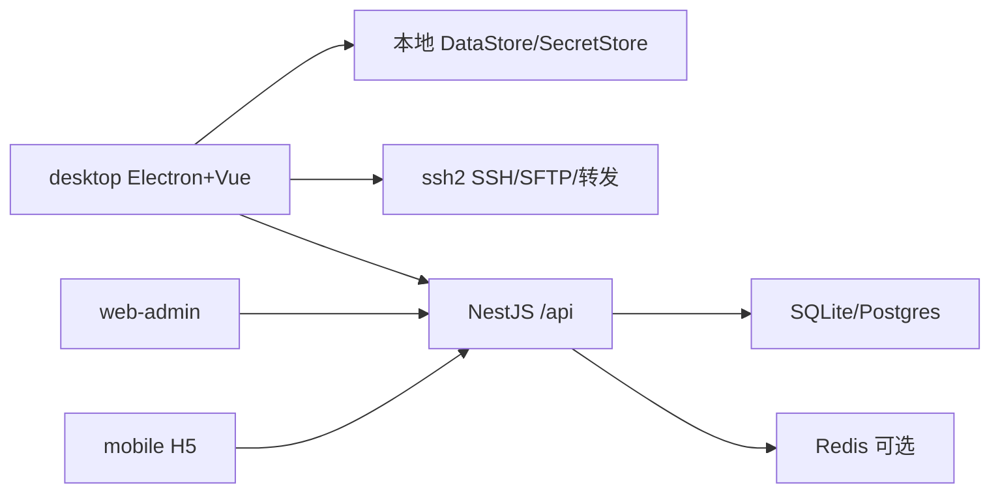

# EZShell · 项目分析总结

> 生成日期：2026-09-10  
> 分析根目录：`projects/ezshell`（LabHub 托管克隆）  
> 说明：基于仓库内 README、docs、package 脚本、源码与 LabHub `data/projects.json` 整理；推断处已标明。

## 1. 一句话定位

**EZShell** 是面向运维与开发者的**跨端 SSH 客户端 + SaaS 会员平台**（pnpm monorepo）：桌面端做真实 SSH/SFTP/转发与配置迁移，API 做账号与权益，管理后台与移动端目前多为空壳。

## 2. 项目概览

| 项 | 内容 |
|---|---|
| 类型 | pnpm Monorepo（4 apps + 4 packages） |
| 主要语言 | TypeScript |
| 包管理器 | pnpm@9.15.4（`packageManager` 锁定） |
| 当前分支 / 版本 | `main` / `0.1.0` |
| 许可证 | 私有，未开源（README） |
| 成熟度 | P0～P2 功能已落地，P2 待真机验收；无 CI workflows |

### 2.1 目标与范围

- 要解决的问题：统一主机/密钥管理、真实 SSH 终端与增强能力（SFTP、片段、转发、导入导出），并以会员套餐（Free/Pro/Team）承载云同步与权益。
- 明确不做的事（需求说明书）：完整跳板机链路、本地系统 Shell、团队实时协作/IM、自研云主机控制台、完整发票税务。

### 2.2 使用者与场景

- 目标用户：个人/小团队运维、需要从 MobaXterm/OpenSSH 迁移的开发者；平台运营人员（管理后台）。
- 典型使用场景：本地跑 API 完成注册登录；桌面端连接真实主机做终端与 SFTP；验收 P2 后进入 P3 云同步。

## 3. 我能用这个项目做什么

> 作为使用者，跑起来之后能得到什么结果。

| # | 我可以… | 得到的结果 | 依据 |
|---|---|---|---|
| 1 | 启动 API 并调用注册/登录/刷新/登出 | 拿到 JWT 令牌对，本地 SQLite 持久化用户 | `POST /api/auth/*`、`README` |
| 2 | 查询 `me` 与权益快照 | 看到 Free/Pro/Team 权益字段 | `GET /api/users/me`、`GET /api/me/entitlements` |
| 3 | 启动桌面端管理主机/分组与密钥 | 本地 JSON 存储主机与密钥，可连接 SSH | `HostPanel`、`KeyPanel`、`electron/*` |
| 4 | 多标签终端 + 指纹/密码确认 | 真实 ssh2 会话与主机指纹确认 | `TerminalWorkspace`、`ssh-manager.cjs` |
| 5 | 使用 P2：SFTP、片段、端口转发、备份与导入 | 文件传输、命令片段、Local 转发、OpenSSH/Moba 导入 | `docs/下一步做什么.md`、对应 Panel |
| 6 | 打开管理后台 / 移动 H5 | 目前多为登录/底栏空壳，可联 API 做联调 | `web-admin` `:5173`、`mobile` `:5175` |

### 3.1 适合谁用 / 不适合做什么

- 适合：本机开发与验收 SSH 桌面能力；对接 NestJS 会员 API；从 Moba/OpenSSH 迁移主机列表。
- 不适合 / 未实现：生产级跳板机、团队协作编辑、完整支付与发票、移动端原生能力（仍标 P0/P4 空壳）、P3 端到端云同步。

### 3.2 与周边系统如何配合

- **LabHub 托管**：克隆于 `labhub/projects/ezshell`，清单 id=`ezshell`，`currentPhase=P2`。
- **启动模式**（可并行）：`api` → `pnpm dev:api`；`desktop` → `pnpm dev:desktop`；`admin` → `pnpm dev:admin`；`mobile` → `pnpm dev:mobile`。默认 profile 为 `api`。
- **构建模式**：LabHub 登记有 `packages` / `all` / 各 app 构建命令；桌面端依赖先跑 `pnpm build:packages`。
- **分期**：P0/P1 已完成；P2 功能已实现待真机验收；P3～P6（权益云同步、移动对齐、后台完善、发布打磨）计划中。
- 提交推送：在 `projects/ezshell` 内 `git push origin` 回到 `https://github.com/yxtao-lab/EZShell.git`。
- 生产目标库为 PostgreSQL + Redis（`docker-compose.yml`）；本地 P0 默认 SQLite。

## 4. 具体实施步骤

### 场景 A：在 LabHub 下登记并本地跑通 API

1. 前置：Node.js ≥ 20；本机已装 **pnpm 9**；LabHub API 已启动（默认 `:8790`）。
2. 若尚未登记（本仓库已登记可跳过）：
   ```bash
   curl -X POST http://127.0.0.1:8790/api/projects \
     -H "Content-Type: application/json" \
     -d "{\"repoUrl\":\"https://github.com/yxtao-lab/EZShell.git\",\"id\":\"ezshell\",\"startCommand\":\"pnpm dev:api\",\"installCommand\":\"pnpm install\",\"openUrl\":\"http://127.0.0.1:3000/api/health\",\"skipInstall\":true}"
   ```
3. 进入托管目录安装与初始化：
   ```bash
   cd projects/ezshell
   pnpm install
   cp .env.example .env
   cp .env.example apps/api/.env
   # 确认 apps/api/.env 中 DATABASE_URL=file:./dev.db
   pnpm build:packages
   pnpm --filter @ezshell/api prisma:generate
   pnpm --filter @ezshell/api exec prisma migrate dev
   pnpm db:seed
   ```
4. 启动 API：
   ```bash
   pnpm dev:api
   # 或在 LabHub 控制台对该项目选「API」模式点「启动」
   ```
5. 验证：
   ```bash
   curl http://localhost:3000/api/health
   ```
   预期返回健康信息；再：
   ```bash
   curl -X POST http://localhost:3000/api/auth/register \
     -H "Content-Type: application/json" \
     -d "{\"email\":\"demo@ezshell.local\",\"password\":\"Demo123456\",\"nickname\":\"演示\"}"
   ```

### 场景 B：启动桌面端并验收 P2

1. 前置：已完成场景 A 的 `pnpm install` 与 `pnpm build:packages`；可选先跑 API。
2. 启动：
   ```bash
   cd projects/ezshell
   pnpm --filter @ezshell/core test
   pnpm dev:desktop
   ```
   渲染进程 Vite 默认 `http://localhost:5174`，并拉起 Electron。也可在 LabHub 选「桌面端」模式启动。
3. 验证（对照 `docs/下一步做什么.md`）：连接真实主机 → SFTP 浏览上下传 → 片段发送 → Local 端口转发 → 设置页导入 `docs/fixtures/openssh/sample_config` 与 `docs/fixtures/moba/sample.mxtsessions`。

### 场景 C：打开管理后台空壳联调

1. 前置：API 已在 `:3000` 运行；`.env` 中 `VITE_API_BASE_URL=http://localhost:3000/api`。
2. 启动：`pnpm dev:admin` → 打开 `http://localhost:5173`。
3. 验证：登录页可打开；用场景 A 注册账号尝试登录（后台能力仍偏空壳）。

### 场景 D：在 LabHub 控制台查看本分析

1. 确认本文件路径：`projects/ezshell/docs/项目分析总结.md`。
2. 打开 LabHub 控制台（默认 `http://127.0.0.1:5177`），选中 **EZShell** →「分析总结」。
3. 或：`GET http://127.0.0.1:8790/api/projects/ezshell/analysis`，`exists` 应为 `true`。

## 5. 技术栈

| 层级 | 选型 | 依据 |
|---|---|---|
| 运行时 | Node ≥ 20、pnpm 9.15.4 | 根 `package.json` |
| API | NestJS 11、Passport JWT、bcryptjs、ioredis | `apps/api/package.json` |
| ORM | Prisma 6（本地 sqlite，生产 postgresql） | `schema.prisma` |
| 桌面 | Electron 35、Vue 3、Vite 6、naive-ui、xterm、ssh2 | `apps/desktop/package.json` |
| 管理端 / 移动 H5 | Vue 3 + Vue Router + Vite | `web-admin` / `mobile` |
| 共享包 | `@ezshell/shared` / `core` / `sdk` / `ui-tokens` | `packages/*` |
| 容器 | Postgres 16、Redis 7（DaoCloud 镜像前缀） | `docker-compose.yml` |

## 6. 架构与目录

### 6.1 逻辑架构



### 6.2 顶层目录职责

| 路径 | 职责 |
|---|---|
| `apps/api` | SaaS API（认证、用户、权益、公告、管理） |
| `apps/desktop` | Electron 桌面 SSH 客户端 |
| `apps/web-admin` | 运营管理后台 |
| `apps/mobile` | 移动端 H5 壳 |
| `packages/*` | 共享类型、纯逻辑、SDK、设计 token |
| `docs/` | 需求、计划、fixtures、本分析 |
| `docker-compose.yml` | Postgres / Redis |

### 6.3 Monorepo 子项目

| 包名 | 路径 | 职责 |
|---|---|---|
| `@ezshell/api` | `apps/api` | NestJS API |
| `@ezshell/desktop` | `apps/desktop` | Electron + Vue |
| `@ezshell/web-admin` | `apps/web-admin` | 管理后台 |
| `@ezshell/mobile` | `apps/mobile` | 移动 H5 |
| `@ezshell/shared` | `packages/shared` | 类型、枚举、错误码、校验 |
| `@ezshell/core` | `packages/core` | OpenSSH/Moba 解析、备份、片段变量等 |
| `@ezshell/sdk` | `packages/sdk` | 前端 API SDK |
| `@ezshell/ui-tokens` | `packages/ui-tokens` | 设计 token |

## 7. 核心模块

| 模块 | 职责 | 关键路径 |
|---|---|---|
| Auth | 注册/登录/刷新/登出 | `apps/api/src/auth/` |
| Users / Entitlements | 当前用户与套餐权益 | `users/`、`entitlements/` |
| Announcements / Admin | 公告列表、手动开通会员 | `announcements/`、`admin/` |
| SSH Manager | 真实 SSH 连接与终端流 | `apps/desktop/electron/ssh-manager.cjs` |
| Forward / SFTP | 端口转发与文件传输 | `forward-manager.cjs`、`SftpPanel.vue` |
| Import/Export | 备份与 OpenSSH/Moba 导入 | `import-export.cjs`、`packages/core` |
| IPC Bridge | 主进程能力暴露给渲染层 | `ipc.cjs`、`preload.cjs` |

## 8. 入口与关键流程

### 8.1 应用入口

- API：`apps/api/src/main.ts`（全局前缀 `/api`，默认端口 3000）
- 桌面 Electron：`apps/desktop/electron/main.cjs`
- 桌面渲染：`apps/desktop/src/main.ts` → `ShellView.vue`
- 管理后台：`apps/web-admin/src/main.ts`
- 移动端：`apps/mobile/src/main.ts`

### 8.2 主流程

**流程 A：邮箱注册登录**

1. 客户端 `POST /api/auth/register` 或 `login`
2. AuthService 写 User / RefreshToken，返回 access + refresh
3. 后续带 JWT 访问 `GET /api/users/me`、`GET /api/me/entitlements`

**流程 B：桌面 SSH 会话**

1. `HostPanel` 选主机 → IPC 调 `ssh-manager`
2. 指纹确认 / 密码对话框
3. `TerminalWorkspace`（xterm）收发终端数据；可切 SFTP / 转发 / 片段

**流程 C：导入主机**

1. 设置页选择 OpenSSH config 或 `.mxtsessions`
2. 主进程 `import-export` + `@ezshell/core` 解析
3. 写入本地 DataStore（样例见 `docs/fixtures/`）

## 9. API 与数据

### 9.1 对外接口

| 方法 | 路径 | 说明 |
|---|---|---|
| GET | `/api/health` | 健康检查 |
| POST | `/api/auth/register` | 注册 |
| POST | `/api/auth/login` | 登录 |
| POST | `/api/auth/refresh` | 刷新令牌 |
| POST | `/api/auth/logout` | 登出 |
| GET | `/api/users/me` | 当前用户（需 JWT） |
| GET | `/api/me/entitlements` | 权益快照（需 JWT） |
| GET | `/api/announcements` | 公告列表 |
| POST | `/api/admin/users/:userId/membership` | 手动开通会员（需 JWT） |

### 9.2 核心数据模型

| 实体 | 说明 | 关键位置 |
|---|---|---|
| User / RefreshToken / DeviceSession | 账号与会话 | `schema.prisma` |
| Plan / Subscription / Order | 套餐与订单 | 同上 |
| Announcement / AdminUser / AuditLog | 运营与审计 | 同上 |
| 主机/密钥/片段（桌面本地） | JSON + SecretStore，非 Prisma | `data-store.cjs`、`secret-store.cjs` |

### 9.3 外部依赖与集成

| 服务 | 用途 | 配置项（变量名） |
|---|---|---|
| SQLite / PostgreSQL | API 持久化 | `DATABASE_URL` |
| Redis | 权益缓存（可降级直查库） | `REDIS_URL` |
| Docker Compose | 可选起 Postgres/Redis | `pnpm db:up`（redis 需 profile `full`） |

## 10. 配置与运行

### 10.1 环境变量（仅名称与用途）

| 变量名 | 用途 | 是否必需 |
|---|---|---|
| `API_PORT` / `API_HOST` | API 监听 | 否（默认 3000 / 0.0.0.0） |
| `DATABASE_URL` | 数据库连接 | 是 |
| `REDIS_URL` | Redis | 否（可降级） |
| `JWT_ACCESS_SECRET` / `JWT_REFRESH_SECRET` | JWT 密钥 | 是 |
| `JWT_ACCESS_EXPIRES_IN` / `JWT_REFRESH_EXPIRES_IN` | 令牌有效期 | 否 |
| `BCRYPT_SALT_ROUNDS` | 密码哈希轮次 | 否 |
| `CORS_ORIGINS` | CORS 白名单 | 建议配置 |
| `VITE_API_BASE_URL` | 前端 API 基址 | 前端联调时需要 |

### 10.2 本地启动

```bash
pnpm install
cp .env.example .env && cp .env.example apps/api/.env
pnpm build:packages
pnpm --filter @ezshell/api prisma:generate
pnpm --filter @ezshell/api exec prisma migrate dev
pnpm db:seed
pnpm dev:api        # :3000/api
pnpm dev:desktop    # Electron + :5174
pnpm dev:admin      # :5173
pnpm dev:mobile     # :5175
```

### 10.3 常用脚本

| 命令 | 作用 |
|---|---|
| `pnpm dev:api` / `dev:desktop` / `dev:admin` / `dev:mobile` | 各端开发启动 |
| `pnpm build:packages` | 编译 packages/* |
| `pnpm db:up` / `db:down` | Docker 依赖 |
| `pnpm db:migrate` / `db:seed` | 迁移与种子 |
| `pnpm test` | 递归有 test 的包（当前主要 core） |

### 10.4 测试与 CI

- 测试：`packages/core/src/p2.test.ts`（片段、OpenSSH、Moba、备份）；根脚本 `pnpm -r --if-present test`。
- CI：仓库内未见 `.github/workflows`。

### 10.5 部署线索

- 生产目标：Prisma 改 `postgresql` + `DATABASE_URL`，`pnpm db:up` 使用 DaoCloud 镜像；桌面端 Electron 打包脚本以各 app 为准。
- LabHub：控制台启停各 profile，不替代各端完整开发流程。

## 11. 工程约定

- 工作区：`apps/*` + `packages/*`；共享 TypeScript 基座 `tsconfig.base.json`。
- 桌面敏感能力仅主进程（备份加解密走 `@ezshell/core/backup-crypto`）。
- 阶段文档以 `docs/下一步做什么.md` 为准（当前 P2 待验收 → P3）。

## 12. 风险、债与未知

- 本地默认 SQLite，与生产 PostgreSQL 有差异，迁移前需改 provider。
- Redis 未就绪时权益缓存降级；compose 中 Redis 映射 `6380→6379` 且需 `full` profile。
- `ssh2` 原生加速未编译时可回退 JS。
- 管理后台 / 移动端能力未齐；无 CI。
- LabHub 端口探测若本机已有其它进程占用 `:3000`，可能误标「运行中」。

## 13. 新人上手路径

1. 阅读：`README.md` → `docs/下一步做什么.md` → 本文。
2. 先完成「场景 A」跑通 health + 注册。
3. 再跑「场景 B」真机 SSH / fixtures 导入。
4. 小改动建议：API 可改 `apps/api/src/health`；桌面 UI 可改 `HostPanel.vue` / `TerminalWorkspace.vue`。

## 14. 参考文件索引

| 主题 | 路径 |
|---|---|
| README | `README.md` |
| 下一步行动 | `docs/下一步做什么.md` |
| 需求 / 计划 | `docs/EZShell需求说明书.md`、`docs/EZShell开发计划.md` |
| 包清单 | `package.json`、`pnpm-workspace.yaml` |
| 环境样例 | `.env.example` |
| API 入口 | `apps/api/src/main.ts` |
| Prisma | `apps/api/prisma/schema.prisma` |
| 桌面主进程 | `apps/desktop/electron/main.cjs` |
| 导入样例 | `docs/fixtures/` |
